# Testing

Return back to the [README.md](README.md) file.

🛑🛑🛑🛑🛑 START OF NOTES (to be deleted) 🛑🛑🛑🛑🛑

In this section, you need to convince the assessors that you have conducted enough testing to legitimately believe that the site works well.
Essentially, in this part, you should go over all of your project's features, and ensure that they all work as intended,
with the project providing an easy and straightforward way for the users to achieve their goals.

🛑🛑🛑🛑🛑 END OF NOTES (to be deleted) 🛑🛑🛑🛑🛑

## Code Validation

### HTML

I have used the recommended [HTML W3C Validator](https://validator.w3.org) to validate all of my HTML files.

| Page | W3C URL | Screenshot | Notes |
| --- | --- | --- | --- |
| Home | [W3C](https://validator.w3.org/nu/?doc=https%3A%2F%2Fjesperba01.github.io%2FProject-2%2Findex.html) | 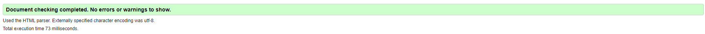 | No Errors |

### CSS

I have used the recommended [CSS Jigsaw Validator](https://jigsaw.w3.org/css-validator) to validate all of my CSS files.

| File | Jigsaw URL | Screenshot | Notes |
| --- | --- | --- | --- |
| style.css | [Jigsaw](https://jigsaw.w3.org/css-validator/validator?uri=https%3A%2F%2Fjesperba01.github.io%2FProject-2) | 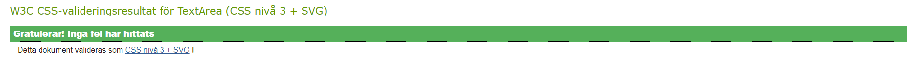 | Pass: No Errors |

### JavaScript

I have used the recommended [JShint Validator](https://jshint.com) to validate all of my JS files.

| File | Screenshot | Notes |
| --- | --- | --- |
| script.js | 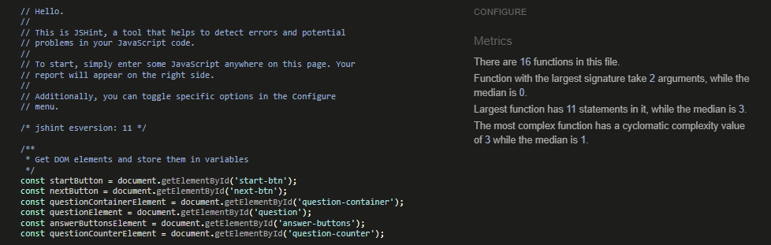 | No Errors |

## Browser Compatibility

| Browser | Home | Notes |
| --- | --- | --- |
| Chrome | 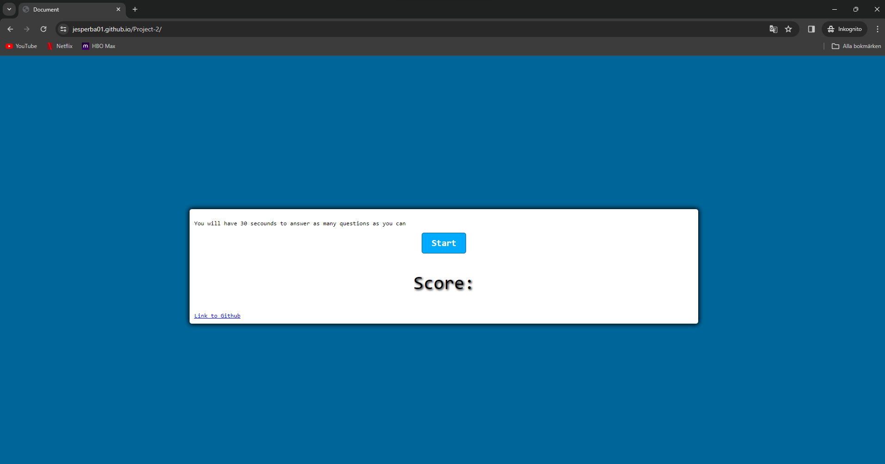 | Works as expected |
| Edge | 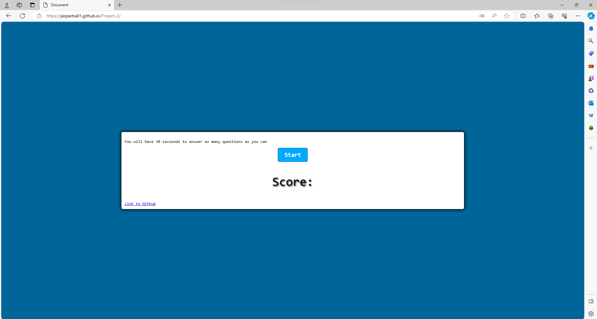 | Works as expected |
| Safari (Mobil edition)| 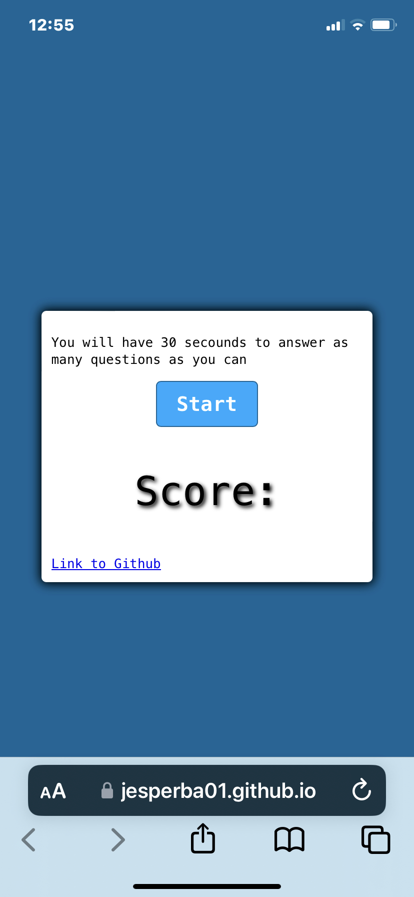 | Works as expected |

## Responsiveness

I've tested my deployed project on multiple devices to check for responsiveness issues.
to make it easier and test my desired devices at the same time i've used a chrome extension calle Responsive viewer that yoou can download here
[Responsive viewer](https://chromewebstore.google.com/detail/responsive-viewer/inmopeiepgfljkpkidclfgbgbmfcennb)
and another chrome extension called GoFullPage that you can fin here [GoFullPage](https://chromewebstore.google.com/detail/gofullpage-full-page-scre/fdpohaocaechififmbbbbbknoalclacl)

Tested devices: Iphone 8, 7, plus 7, plus 6s, plus | Galaxy S9, Note 8, S8 | Ipad(standard) | Nexus 10 | Desktop | Ipad mini | Ipad pro | laptop 1/2 |

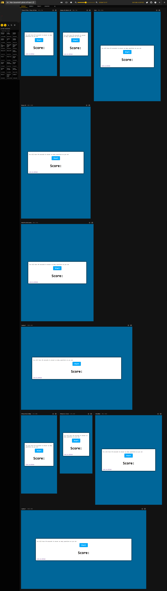

## Lighthouse Audit

I've tested my deployed project using the Lighthouse Audit tool to check for any major issues.

| Page | Mobile | Desktop | Notes |
| --- | --- | --- | --- |
| Home | 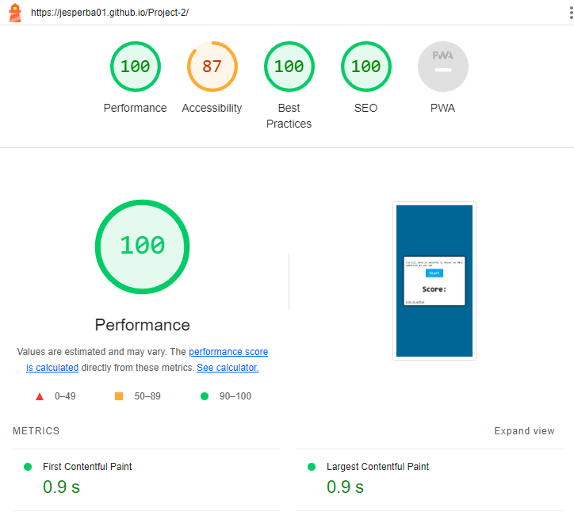 | 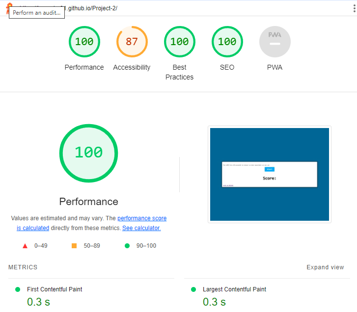 | No issues |

## Defensive Programming

| Page | User Action | Expected Result | Pass/Fail | Comments |
| --- | --- | --- | --- | --- |
| Home | | | | |
| | Click on start button | starts game | Pass | |
| | Click on answer button | shows correct or wrong and shows next button | Pass | |
| | Click on next button | shows next question | Pass | |
| | Click on restart button | restarts the game | Pass | |

## Bugs

🛑🛑🛑🛑🛑 START OF NOTES (to be deleted) 🛑🛑🛑🛑🛑

This section is primarily used for JavaScript and Python applications,
but feel free to use this section to document any HTML/CSS bugs you might run into.

It's very important to document any bugs you've discovered while developing the project.
Make sure to include any necessary steps you've implemented to fix the bug(s) as well.

**PRO TIP**: screenshots of bugs are extremely helpful, and go a long way!

🛑🛑🛑🛑🛑 END OF NOTES (to be deleted) 🛑🛑🛑🛑🛑

- Time dosent stop when you run och of questions 

  - To fix this, I added "clearIntrevalt" to endgame function and called it when there were no more questions 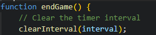
  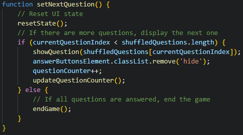

- JS `'let'` or `'const'` or `'template literal syntax'` or `'arrow function syntax (=>)'` is available in ES6 (use `'esversion: 11'`) or Mozilla JS extensions (use moz).

    

  - To fix this, I _____________________.

- Python `'ModuleNotFoundError'` when trying to import module from imported package

    

  - To fix this, I _____________________.

- Django `TemplateDoesNotExist` at /appname/path appname/template_name.html

    

  - To fix this, I _____________________.

- Python `E501 line too long` (93 > 79 characters)

    

  - To fix this, I _____________________.

